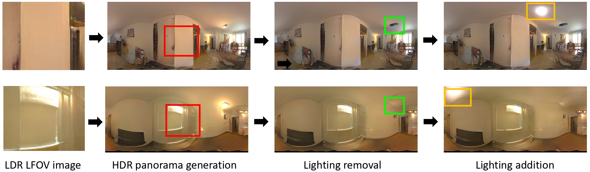

# StyleLight: HDR Panorama Generation for Lighting Estimation and Editing  

### [Project](https://style-light.github.io/) | [YouTube](https://www.youtube.com/watch?v=sHeWK1MSPg4) | [arXiv](https://www.youtube.com/watch?v=sHeWK1MSPg4) 


>**Abstract:** We present a new lighting estimation and editing framework to generate high-dynamic-range (HDR) indoor panorama lighting from a single limited field-of-view (FOV) image captured by low-dynamic-range (LDR) cameras. Existing lighting estimation methods either directly regress lighting representation parameters or decompose this problem into FOV-to-panorama and LDR-to-HDR lighting generation sub-tasks. However, due to the partial observation, the high-dynamic-range lighting, and the intrinsic ambiguity of a scene, lighting estimation remains a challenging task. To tackle this problem, we propose a coupled dual-StyleGAN panorama synthesis network (StyleLight) that integrates LDR and HDR panorama synthesis into a unified framework. The LDR and HDR panorama synthesis share a similar generator but have separate discriminators. During inference, given an LDR FOV image, we propose a focal-masked GAN inversion method to find its latent code by the LDR panorama synthesis branch and then synthesize the HDR panorama by the HDR panorama synthesis branch. StyleLight takes FOV-to-panorama and LDR-to-HDR lighting generation into a unified framework and thus greatly improves lighting estimation. Extensive experiments demonstrate that our framework achieves superior performance over state-of-the-art methods on indoor lighting estimation. Notably, StyleLight also enables intuitive lighting editing on indoor HDR panoramas, which is suitable for real-world applications. Our code will be released to facilitate future research.

[Guangcong Wang](https://wanggcong.github.io/), [Yinuo Yang](https://www.linkedin.com/in/yinuo-yang-489487245/), [Chen Change Loy](https://www.mmlab-ntu.com/person/ccloy/), [Ziwei Liu](https://liuziwei7.github.io/)

S-Lab, Nanyang Technological University

In **European Conference on Computer Vision (ECCV)**, 2022  

## 1. Prerequisites
- Linux or macOS
- Python 3
- NVIDIA GPU + CUDA cuDNN(10.2)
- PyTorch >= 1.7
- OpenCV

## 2. Installation
We recommend using the virtual environment (conda) to run the code easily.

```
conda create -n StyleLight python=3.7 -y
conda activate StyleLight
pip install lpips
pip install wandb
conda install pytorch==1.7.1 torchvision==0.8.2 torchaudio==0.7.2 cudatoolkit=10.2 -c pytorch

pip install matplotlib
pip install dlib
pip install imageio
pip install einops

sudo apt-get install openexr and libopenexr-dev
pip install OpenEXR

pip install imageio-ffmpeg
pip install ninja
pip install opencv-python
```


## 3. Training 
### Download dataset
- Please download the Laval dataset from the [official website](http://indoor.hdrdb.com/).

### Pre-process datasets
- Set the variables *the path to the laval dataset(from_folder)* and *the path to save pre-processed data (to_folder)* in data_prepare_laval.py
```
python data_prepare_laval.py
```
### Train StyleLight
```
python train.py --outdir=./training-runs-256x512 --data=/mnt/disks/data/datasets/IndoorHDRDataset2018-128x256-data-splits/train --gpus=8 --cfg=paper256  --mirror=1 --aug=noaug
```
- --outdir is the path to save models and generated examples
- --gpus is the number of gpus
- --data is the path to the pre-processed data
- --cfg is the configure of stylegan-ada
- --mirror and --aug is data augmentation

### Or download inference model
- Please download the inference model from the [Google Drive](https://drive.google.com/file/d/1vHfwrtgk0EjZlS14Ye5lASJ0R4IWl_4w/view?usp=sharing).


## 4. Test 
### Lighting estimation and editing
- Set paths (*stylegan2_ada_ffhq*) in PTI_utils/paths_config.py 
- Set options (*lighting estimation* or *lighting editing*) in PTI_utils/hyperparameters.py
```
python test_lighting.py
```


## 5. To-Do
- [x] Training code
- [x] Inference model
- [ ] Evaluation code
- [ ] Clean Code
- [ ] Colab Demo


## 6. Citation

If you find this useful for your research, please cite the our paper.

```
@inproceedings{wang2022stylelight,
   author    = {Wang, Guangcong and Yang, Yinuo and Loy, Chen Change and Liu, Ziwei},
   title     = {StyleLight: HDR Panorama Generation for Lighting Estimation and Editing},
   booktitle = {European Conference on Computer Vision (ECCV)},   
   year      = {2022},
  }
```

or
```
Guangcong Wang, Yinuo Yang, Chen Change Loy, and Ziwei Liu. StyleLight: HDR Panorama Generation for Lighting Estimation and Editing, ECCV 2022.
```

## 7. Related Links
[Relighting4D: Neural Relightable Human from Videos, ECCV 2022](https://github.com/FrozenBurning/Relighting4D)

[Gardner et al. Learning to Predict Indoor Illumination from a Single Image, SIGGRAPH Asia, 2017.](http://vision.gel.ulaval.ca/~jflalonde/publications/projects/deepIndoorLight/index.html)

[Gardner et al. Deep Parametric Indoor Lighting Estimation, ICCV 2019.](http://vision.gel.ulaval.ca/~jflalonde/publications/projects/deepIndoorLight/index.html)

[Zhan et al. EMlight:Lighting Estimation via Spherical Distribution Approximation, AAAI 2021.](https://github.com/fnzhan/Illumination-Estimation)


## 8. Acknowledgments
This code is based on the [StyleGAN2-ada-pytorch](https://github.com/NVlabs/stylegan2-ada-pytorch) and [PTI](https://github.com/danielroich/PTI) codebases. 
